# RT Profiling Tool User Guide

</br>

## Table of Contents

* [1 Introduction](#1)
  * [1.1 Overview](#1.1)
* [2 Step by step instructions on RT-Profiling tool](#2)
  * [2.1 Setup environment](#2.1)
    * [2.1.1 Install software dependencies](#2.1.1)
    * [2.1.2 Get the source code](#2.1.2)
    * [2.1.3 Build latency utilities](#2.1.3)
    * [2.1.4 Build cyclictest utilities](#2.1.4)
    * [2.1.5 Make nmon/nmonchart executable](#2.1.5)
  * [2.2 Generate RT performance data](#2.2)
    * [2.2.1 Generate Jitter/Cycle data with latency](#2.2.1)
    * [2.2.2 Generate Jitter/Cycle data with cyclictest](#2.2.2)
  * [2.3 Collect RT performance data](#2.3)
    * [2.3.1 Observe the performance data in interactive mode](#2.3.1)
    * [2.3.2 Capture the performance data in data collector mode](#2.3.2)
  * [2.4 Generate html page](#2.4)
  * [2.5 Analyze the result](#2.5)
  * [2.6 Use node.js to directly generate html page recognized by eCharts from .nmon file](#2.6)
	* [2.6.1 Dependency software](#2.6.1)
	* [2.6.2 Generate html page](#2.6.2)
  * [2.7 Display html page based on eCharts](#2.7)
	* [2.7.1 Page button function](#2.7.1)
	* [2.7.2 Scatter chart page function](#2.7.2)
	* [2.7.3 Bar chart page function](#2.7.3)
	* [2.7.4 Line chart page function](#2.7.4)
* [3 Roadmap](#3)
  * [3.1 Supported features](#3.1)
  * [3.2 In progress features](#3.2)
  * [3.3 Todo Features](#3.3)    
* [4 License](#4)

<br/>

# <a name="1"/>1 Introduction

## <a name="1.1"/>1.1 Overview

In industrial controller scenarios, the real-time performance indicators like jitter & cycle time are the two key criteria to evaluate the performance of RT control system. However, how to troubleshoot and tune real-time performance is always a challenge to developers. There are many factors like IRQs, network traffic could affecting the overall performance of RT control system.

This document provides a step-by-step guidance for RT control system developers/analyzers on how to setup, collect and analyze real-time control related jitter/cycle parameters as well as other system characters of the real-time control system like CPU utilization, disks accessing, network transferring, IRQs using customized nmon/nmonchart toolset.

<br/>

# <a name="2"/>2 Step by step instructions on RT-Profiling tool

## <a name="2.1"/>2.1 Setup environment

The RT profiling tool should be able to run on all the latest Linux distributions theoretically. We will use Linux Ubuntu 16.04 x64 LTS as the default environment throughout this guide in order to minimize clutters caused by various Linux distributions.

### <a name="2.1.1"/>2.1.1 Install software dependencies

Please install *gcc*, *make*, *git* utilities and *ncurses* dev lib on the target system if any of these packages is unavailable on the system.

1. Connect to the internet.

2. Open a command prompt terminal window.

3. Type following instruction in the terminal, input root password as prompt. Please adjust the command accordingly to install the corresponding dependency if you use Fedora or other Linux distributions.

```Shell
sudo apt install gcc libncurses5-dev make git build-essential kernel-package fakeroot libssl-dev
```

### <a name="2.1.2"/>2.1.2 Get the source code

Get the latest source code of RT-Profiling tool from the git server or from package file offline.

1. Get the source code from the git server.

```Shell
git clone https://github.com/intel/rt-perf-profiling-tool
```

### <a name="2.1.3"/>2.1.3 Build latency utilities

Type following commands in the terminal to build **latency** utilities.

1. Get xenomai source code.

```Shell
wget https://xenomai.org/downloads/xenomai/stable/xenomai-3.0.7.tar.bz2
tar -jxvf xenomai-3.0.7.tar.bz2
```

2. Apply the patch for latency utility. Where *xxx* stands for the absolute path of patch **0001-capture-jitter-performance-in-share-memory.patch** under *collection/latency* folder you got at step 2.1.2.

```Shell
cd xenomai-3.0.7/
git apply --reject xxx
```

3. Build **latency** utility.

```Shell
./configure --with-core=cobalt --enable-smp --enable-pshared
make
```

### <a name="2.1.4"/>2.1.4 Build cyclictest utilities

Type following commands in the terminal to build **cyclictest** utilities.

1. Get rt-tests source code v1.0.

```Shell
git clone https://git.kernel.org/pub/scm/utils/rt-tests/rt-tests.git
cd rt-tests/
git checkout stable/v1.0
```

2. Apply the patch for cyclictest utility. Where *yyy* stands for the absolute path of patch **0001-capture-latency-in-share-memory.patch** under collection/cyclictest folder you got at step 2.1.2.

```Shell
git apply --reject yyy
```

6. Build **cyclictest** utility.
```Shell
make
```

### <a name="2.1.5"/>2.1.5 Make nmon/nmonchart executable

Build **nmon** utility, and then make **nmon** utility and **nmonchart** script executable at any place.

1. Move to the nmon directory.

```Shell
cd rt_profiling-tool/agent/nmon
```

2. Execute following command to build nmon binary. Where *arch* stands for the CPU architecture of the system under test, *os* stands for the target operating system nmon will be executed. We'll use *nmon_AMD64_ubuntu1604* as an example here. Please specify the designated configuration combination value as the parameter of the **make** according to the real condition. 

```Shell
make <nmon_arch_os>
```

3. Setup the symbolic link of nmon utility. Here we use *nmon_AMD64_ubuntu1604* as the sample, please adjust it for your self. 

```Shell
sudo ln -s rt_profiling-tool/agent/nmon/nmon_AMD64_ubuntu1604 /usr/local/bin/nmon
```

4. Setup the symbolic link of nmonchart script.

```Shell
sudo ln -s rt_profiling-tool/analysis/nmonchart/nmonchart /usr/local/bin/nmonchart
```

## <a name="2.2"/>2.2 Generate RT performance data

We can use latency or cyclictest utility to generate RT performance data.

### <a name="2.2.1"/>2.2.1 Generate Jitter/Cycle data with latency

You can launch **latency** in terminal to generate RT performance data.

```Shell
sudo ./latency -r
```

> ***-r***: update jitter performance in share memory

Notes: If you met following error message:

  *0"000.000| BUG in low_init(): [main] Cobalt core not enabled in kernel*

It means that the cobalt core of xenomai is not enabled in the linux kernel. Please build the xenomai enabled kernel and utilize it as the system kernel.  

### <a name="2.2.2"/>2.2.2 Generate Jitter/Cycle data with cyclictest

You can launch **cyclictest** in terminal to generate RT performance data.

```Shell
sudo ./cyclictest -N -t 4 -e
```
>
> ***-N***: show results in nanoseconds
>
> ***-t 4***: start 4 threads to measure latency
>
> ***-e***: update latency performance in share memory

## <a name="2.3"/>2.3 Collect RT performance data

Nmon can gives you a huge amount of important performance information in one go. It can output the data on the screen in interactive mode or save the data to a comma separated file for analysis in data collector mode.

### <a name="2.3.1"/>2.3.1 Observe the performance data in interactive mode

You can observe the Jitter time, Cycle time as well as CPU, memory, network, disks etc. data directly on the screen and updated every second if you launch the nmon without arguments.

1. Open a terminal, type *nmon*. Nmon with help info page will pop up.

<div style="width: 100%; text-align: center;">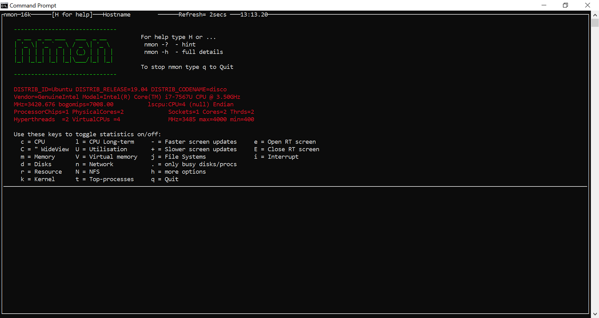</img></div>

2. You can press the corresponding keys to toggle on or off statistics. Say, you can press "ecCUd" to show RT info, CPU Utilization, CPU Utilization Stats, CPU Utilization Wide View and Disk I/O info.

<div style="width: 100%; text-align: center;">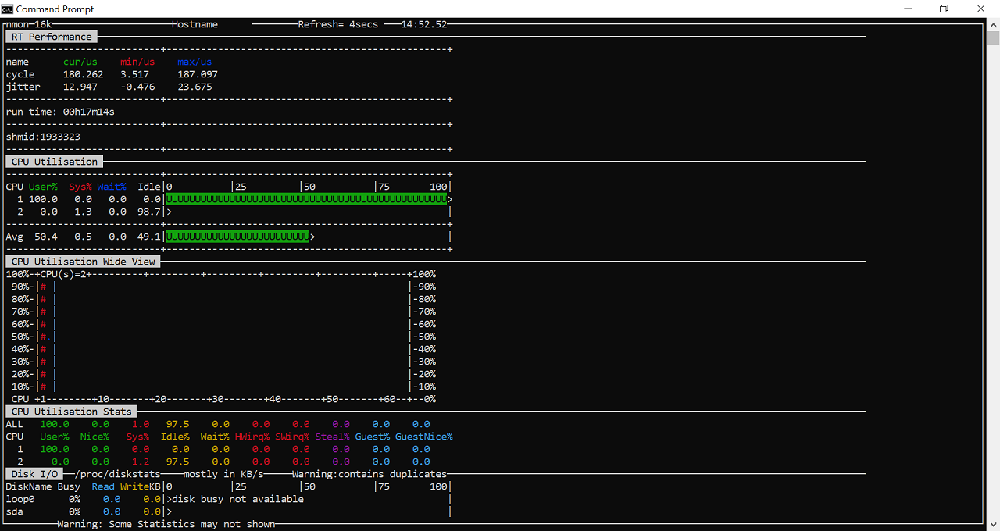</img></div>

3. You can press "+" or "-" key to increase or decrease nmon sampling
intervals in real time. By default, the screen refresh time is two
seconds. The minimum refresh time is one second.

### <a name="2.3.2"/>2.3.2 Capture the performance data in data collector mode

1. Open a terminal, launch **nmon** utility with parameters specified. The .nmon data files it captured will be saved under *YYMMDD_HHMM* folder(where *YYMMDD* and *HHMM* are the beginning time of the collection).

```Shell
nmon -feiTU -s 1 -c 36000
```

> Notes: Following parameters are supported when ***nmon*** is launched.
>
> ***-f***: Must be the first option on the line (switches off
> interactive mode). Saves data to a CSV Spreadsheet format .nmon file
> in the local directory
>
> ***-e***: Specify RT Performance info to be collected
>
> ***-i***: Specify IRQ info to be collected.
>
> ***-t***: Collect Top Process info also
>
> ***-T***: Collect command line info also
>
> ***-U***: Collect CPU Utils info als；
>
> ***-s <seconds>***: Time between data snapshots
>
> ***-c <count>***: Of snapshots before exiting。
>
> Eg: -feiTU -s 1 -c 36000 stands for collect the data for 36000 times with time interval for one second. IRQ and Top process info are collected also. The .nmon file will be saved on current folder for further investigation by default.

## <a name="2.4"/>2.4 Generate html page

Open a terminal, move to the folder where nmon utilities are saved. Execute nmonchart script to generate html files.

```Shell
nmonchart HHMMDD__HHMMM
```
> *HHMMDD_HHMMM* is the folder name where .nmon data files are stored.


The webpage files *xxxx.html* will be generated under ***HHMMDD_HHMMM*** folder.

## <a name="2.5"/>2.5 Analyze the result

Double click the xxxx.html file generated by nmonchart to open the dynamic webpage as Figure 2.5.1.

<div style="width: 100%; text-align: center;">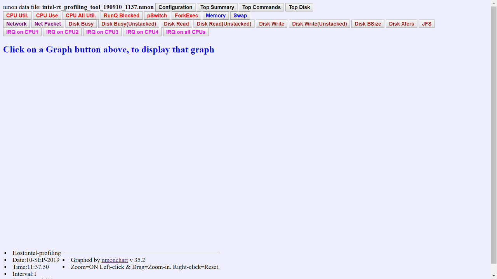</img></div>

> Figure 2.5.1 Homepage of nmonchart

You can click **Configuration**, **Top Summary**, **Top Command** and **Top Disk** buttons separately on the first row to get the overall information, overall CPU consumptions and disk usage.

You can click on **CPU util.** **CPU Use** and **CPU All Utils,** button to monitor CPU related criteria.

<div style="width: 100%; text-align: center;">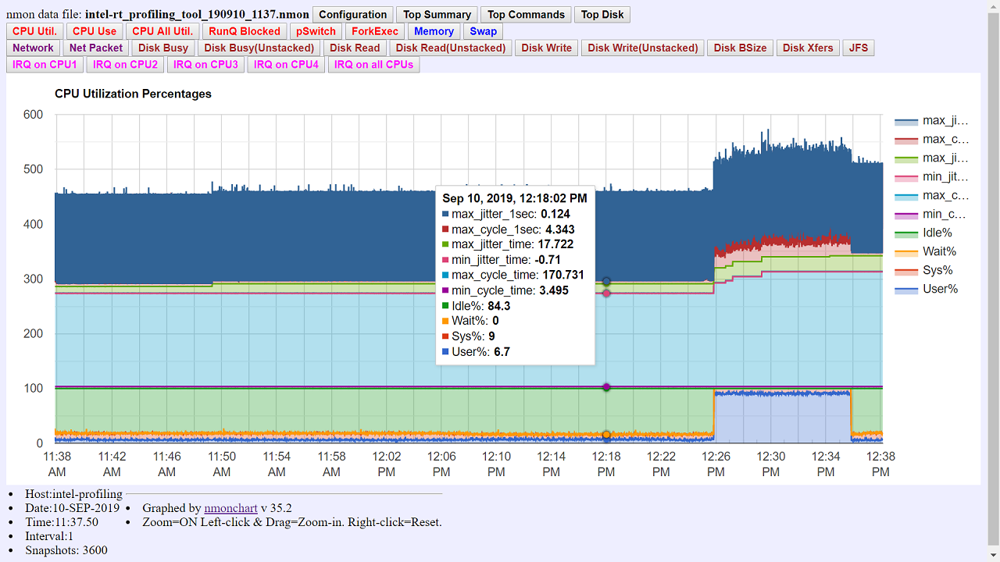</img></div>

> Figure 2.5.2 nmonchart

## <a name="2.6"/>2.6 Use node.js to directly generate html page recognized by eCharts from .nmon file

### <a name="2.6.1"/>2.6.1 Dependency software

If node.js is not installed on the system, download and install node.js first.

### <a name="2.6.2"/>2.6.2 Generate html page

Open the CMD window, enter the directory where nmontohtml.js is located, and execute the command. XXX is the full or relative path of the .nmon file or folder to be converted, separated by spaces between multiple files 
```Shell
node nmonToHtml.js XXX XXX
```

> Notes：The HTML generated by nmontohtml.js file depends on the files in JS folder and CSS folder, so please do not change the file structure to avoid HTML file display and function errors. 
> The main dependency file for the chart is eCharts.min.js. Including Chart, Coordinate Systems and Components 
> Chart: Including Bar, Line, Pie, Scatter and EffectScatter.

<div style="width: 100%; text-align: center;">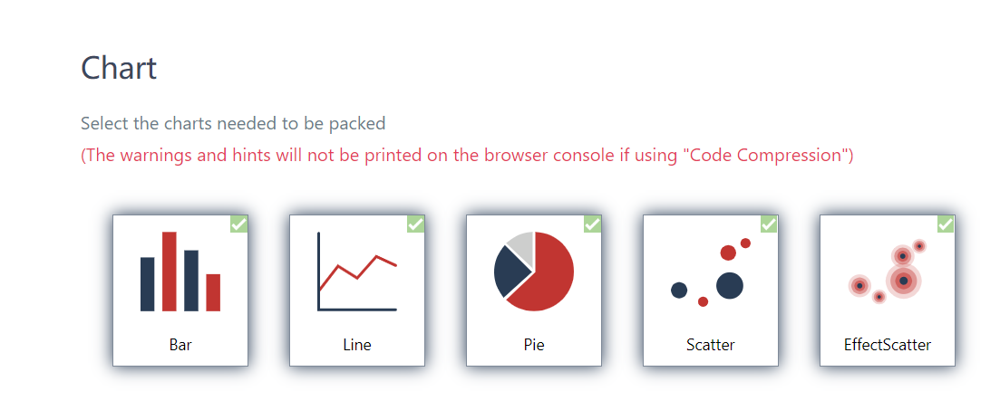</img></div>

> Figure 2.6.1 Chart
>
> Coordinate Systems: Including Grid.

<div style="width: 100%; text-align: center;">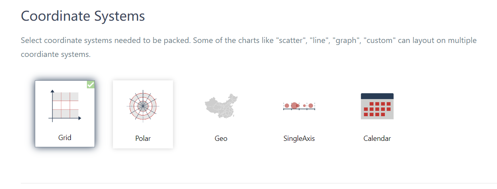</img></div>

> Figure 2.6.2 Coordinate Systems
>
> Components: Inculding Title, Legend, Tooltip, MarkPoint, MarkLine, MarkArea, Timeline and DataZoom.

<div style="width: 100%; text-align: center;">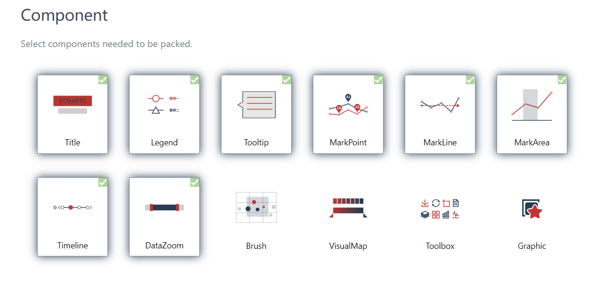</img></div>

> Figure 2.6.3 Components
>
> Check "Code Compression" to indicate that the customized file is compressed: "echart.min.js". 

<div style="width: 100%; text-align: center;">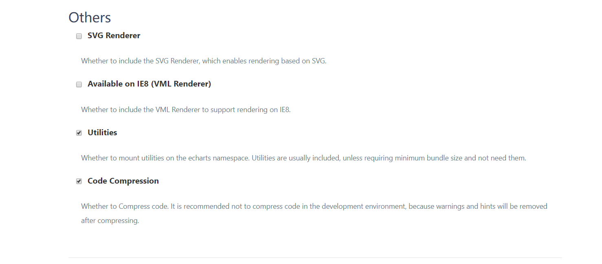</img></div>

> Figure 2.6.4 Compress
>
> The main dependency file for the HTML is jquery-3.4.1.min.js. Version 3.4.1 is recommended. 
> Download address: https://jquery.com/download/. Click "Download the compressed, production jQuery 3.4.1" on the page to perform the download. 

<div style="width: 100%; text-align: center;">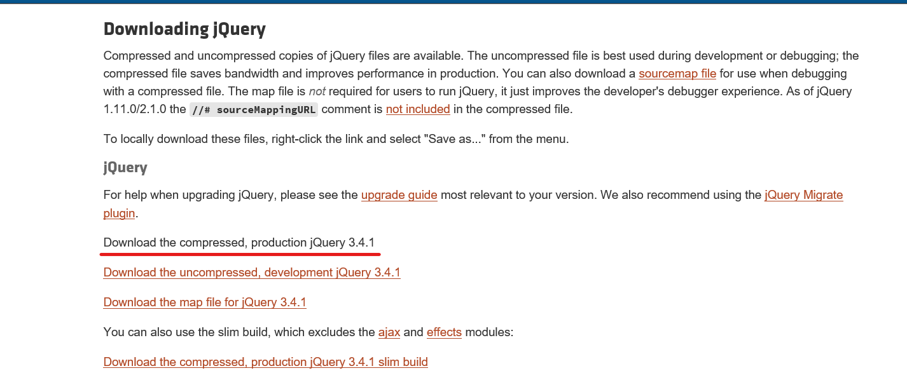</img></div>

> Figure 2.6.5 JQuery Download
>
> When the .nmon file is too large, it takes a long time to generate the HTML file. Please wait patiently. 

## <a name="2.7"/>2.7 Display html page based on eCharts

### <a name="2.7.1"/>2.7.1 Page button function

After hovering and selecting, the color will be changed and shadow background will be added for easy recognition, as Figure 2.7.1. 

<div style="width: 100%; text-align: center;">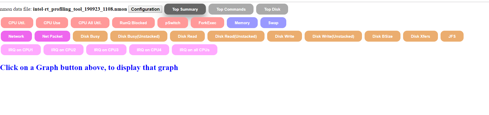</img></div>

> Figure 2.7.1 page button function 

### <a name="2.7.2"/>2.7.2 Scatter chart page function

1. When the mouse hovers over the circle, the detailed data of the current circle will be displayed on the edge of the mouse and inside the circle, as Figure 2.7.2. 

<div style="width: 100%; text-align: center;">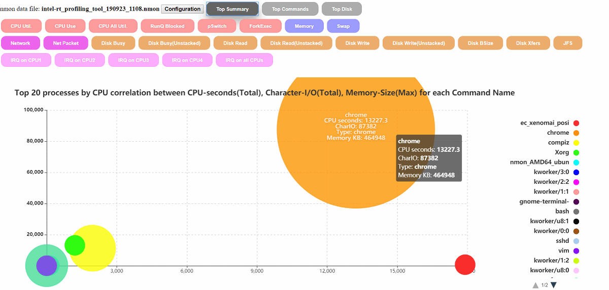</img></div>

> Figure 2.7.2 Scatter chart function 1 

2. When the mouse hovers over the legend on the right, the detailed data of the corresponding circle will be displayed in the circle corresponding to the legend, as Figure 2.7.3. 

<div style="width: 100%; text-align: center;">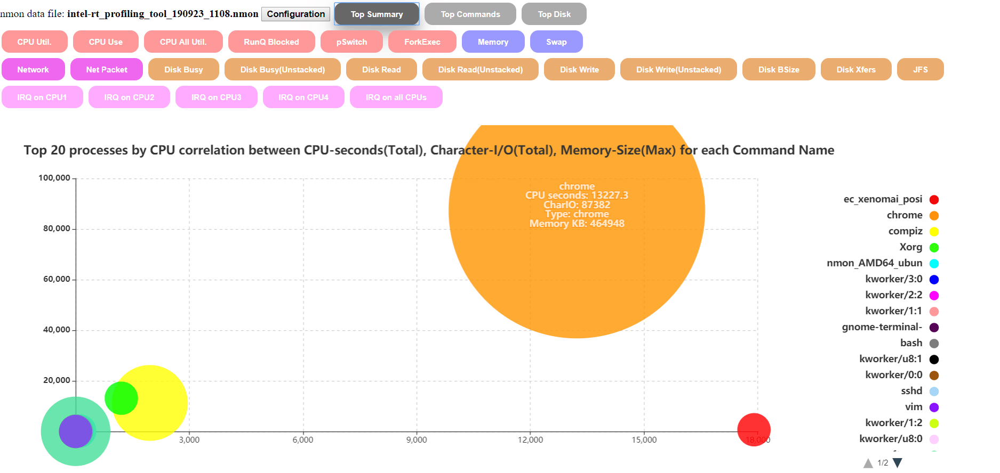</img></div>

> Figure 2.7.3 Scatter chart function 2 

3. When the mouse clicks on the legend, the data corresponding to the currently clicked legend will be hidden. Click again to restore, as Figure 2.7.4. 

<div style="width: 100%; text-align: center;">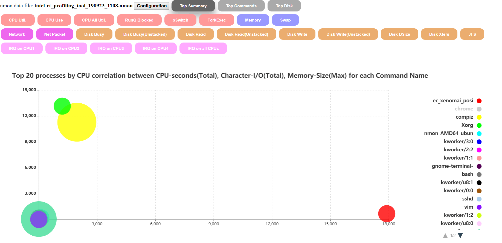</img></div>

> Figure 2.7.4 Scatter chart function 3

### <a name="2.7.3"/>2.7.3 Bar chart page function

The display mode of the page is stacked display. 

1. When the mouse hovers over the histogram, the data of the corresponding legend in the area will be displayed, as Figure 2.7.5. 

<div style="width: 100%; text-align: center;">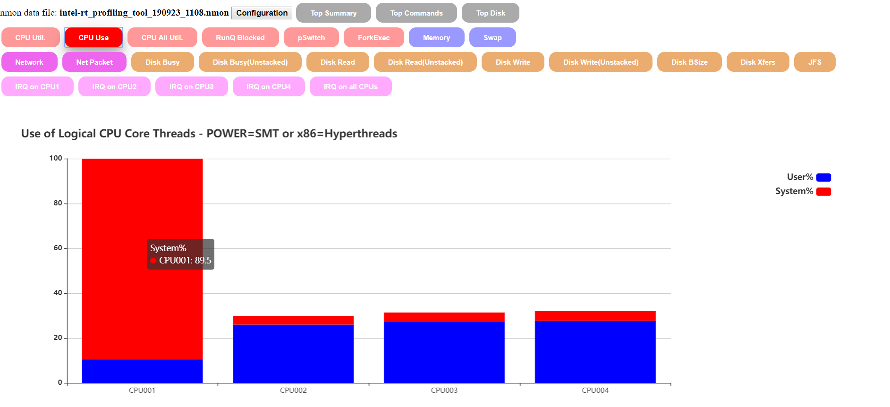</img></div>

> Figure 2.7.5 Bar chart function 1

2. When the mouse clicks on the legend, the data corresponding to the currently clicked legend will be hidden. Click again to restore, as Figure 2.7.6.

<div style="width: 100%; text-align: center;">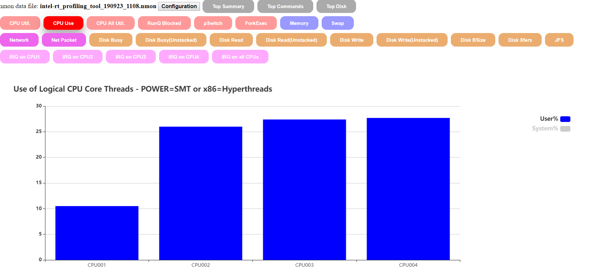</img></div>

> Figure 2.7.6 Bar chart function 2 

### <a name="2.7.4"/>2.7.4 Line chart page function

1. The X axis is displayed as a dynamic area, which can be zoomed freely. Use through the mouse wheel or the area thumbnail below (click somewhere of the area thumbnail or stretch the covered area), as Figure 2.7.7. 

<div style="width: 100%; text-align: center;">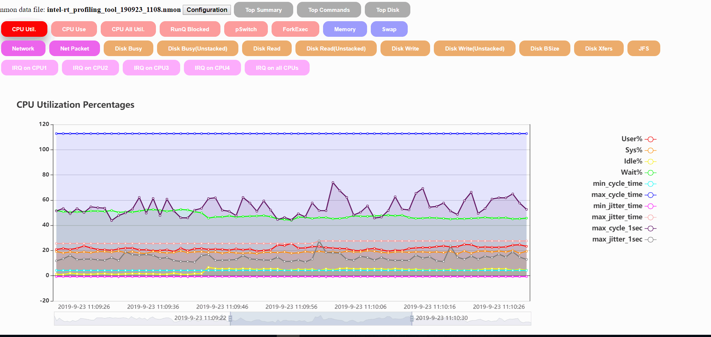</img></div>

> Figure 2.7.7 Line chart function 1 

2. When the mouse hovers over the legend, the line chart node of the corresponding legend will be marked, as Figure 2.7.8. 

<div style="width: 100%; text-align: center;">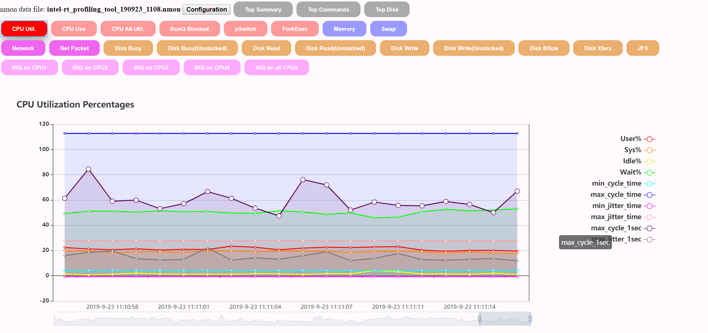</img></div>

> Figure 2.7.8 Line chart function 2

3. When you click the legend, the corresponding line chart will be displayed on the right Y axis, as Figure 2.7.9. 

<div style="width: 100%; text-align: center;">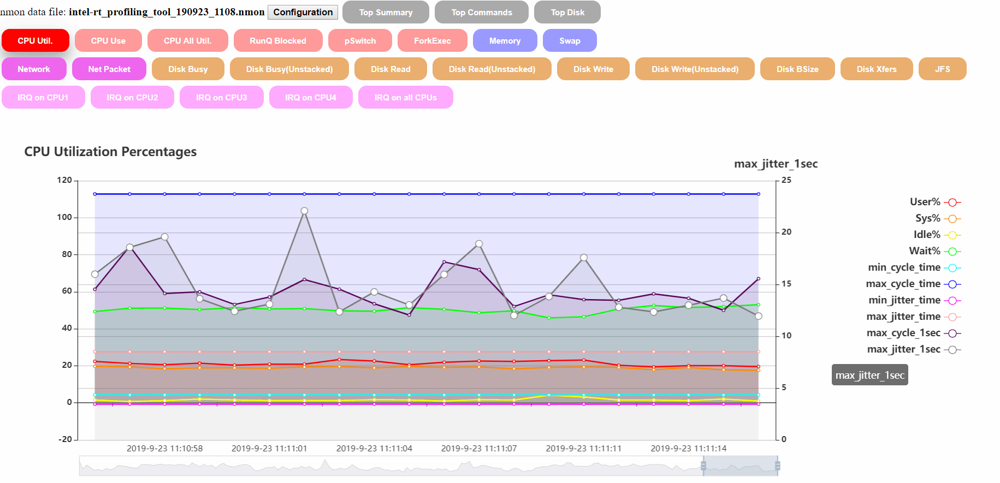</img></div>

> Figure 2.7.9 Line chart function 3

4. When the mouse hovers over the chart, the data of all the lines chart on the X axis corresponding to the mouse position will be displayed, as Figure 2.7.10. 

<div style="width: 100%; text-align: center;">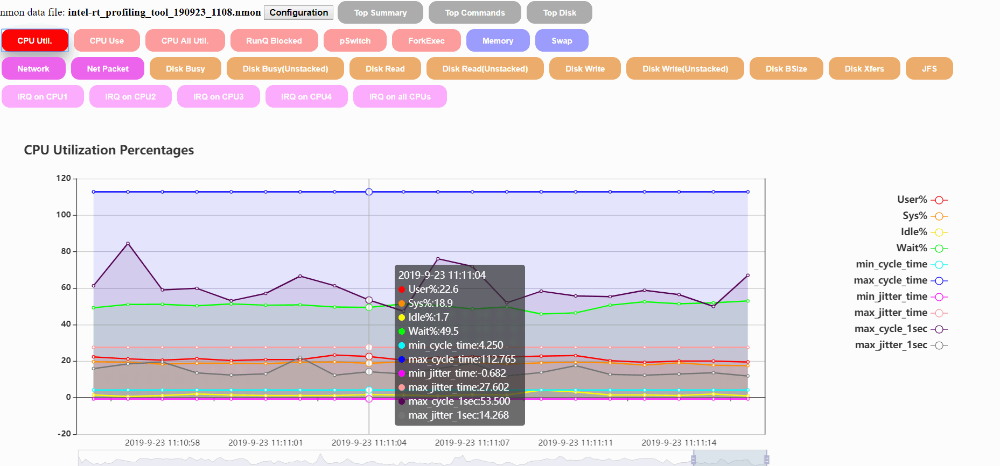</img></div>

> Figure 2.7.10 Line chart function 4

# <a name="3"/>3 Roadmap
## <a name="3.1"/>3.1 Supported features
* Nmon based data agent
    * Support cyclic data source
    * Support latency data source
    * Support real-time data metrics
    * Support disk/mem/net/interrupt etc.. Data metrics
* Web based visualization
    * Charting for misc. data metrics
    * Real-time data metrics  showing with defined & selected other metrics
* Web based visualization (eCharts page) 
	* Change code base to echarts based chart 
	* Dual-Y axis to show data in different granularity
	* Flexible chart area display 
	* Button selection for more intuitive display 

## <a name="3.2"/>3.2 In progress features
* Web based visualization (eCharts page) 
    * eCharts page style optimization 

## <a name="3.3"/>3.3 Todo Features
* Nmon based data agent
    * support msi_latency data source
* Web based visualization
    * Charting for misc. data metrics
    * Real-time data metrics showing with defined & selected other metrics
    * jitter statistics analysis
    * Scoring
    * normal distribution
    * Sorting
    * Plugin based value-adding analysis module framework & sample code
    * Correlation
    * Abnormal
    * Value added modules

# <a name="4"/>4 License
The source code is licensed under GNU General Public License v3.0 or later. See [LICENSE](LICENSE) file for details.
It includes software developed from 3rd-party, See [NOTICE](NOTICE) file for details.
